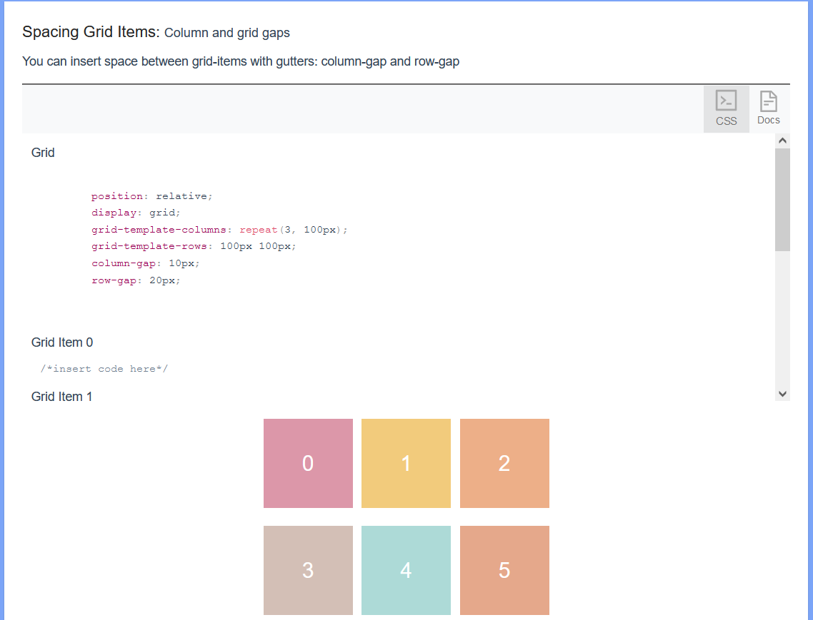

# Understanding CSS Grids

<h3>Description</h3>

    This <a href = "https://nervous-snyder-5fcce6.netlify.app/">interactive website</a> outlines how to utilize CSS grid for web-development. It was built using React and Redux and partially designed with Ant Design by the Ant Group.

<h3>Website Visuals</h3>

